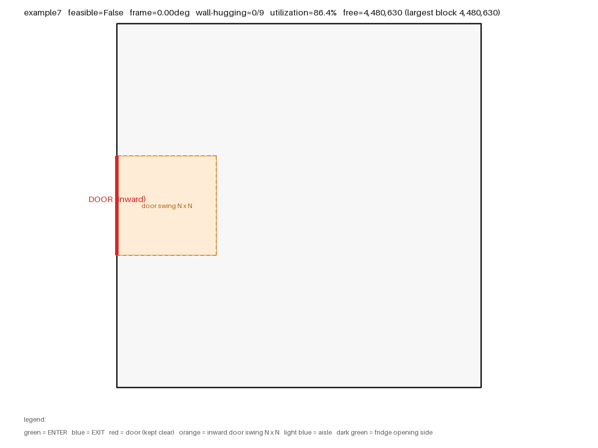

# 门店设备自动摆放求解器（居灵 Take-Home 工程题）

给定任意多边形轮廓、**一到两扇门**（各自可内开/外开）与若干矩形设备，自动求出一套
**不越界、不重叠、不挡门、留出人行通道、物品贴墙并分列通道两侧**的摆放方案，
输出每件物品的中心点坐标与旋转角度，并给出空间利用率等量化指标。

语言：**Python 3**（核心求解只用标准库，出图需要 Pillow）。

---

## 结果一览（7 个样例）

| 样例 | 件数 | 门 | 朝向 | 输出角度 | 可行 | 贴墙 | 墙边利用 | 通道宽 | 临通道 | 利用率 | 耗时 |
|---|---|---|---|---|---|---|---|---|---|---|---|
| example1（题目） | 8 | 1 | 15.85° | 15.85° / 105.85° | ✅ | 5/8 | 37% | 640 | 8/8 | 47.5% | 7.9 s |
| example2（题目） | 8 | 1 | 0° | 0° / 90° | ✅ | 7/8 | **76%** | 496 | 8/8 | 51.2% | 11.5 s |
| example3（题目，内开门） | 9 | 1 | 0° | 0° / 90° | ✅ | 9/9 | 50% | 496 | 9/9 | 37.7% | 10.8 s |
| example4（题目） | 6 | 1 | 0° | 0° / 90° | ✅ | 6/6 | 62% | 640 | 6/6 | 47.8% | 10.4 s |
| example5（example1 旋转 30°） | 8 | 1 | **29.99°** | **29.99° / 119.99°** | ✅ | 3/8 | 38% | 360 | 8/8 | 47.5% | 10.7 s |
| example6（20° 斜墙，**两扇门**） | 9 | **2** | **20°** | **20° / 110°** | ✅ | 5/9 | 32% | **800** | 6/9 | 45.5% | 5.0 s |
| example7（小房间塞 9 件） | 9 | 1 | – | – | ❌ 不可行 | – | – | – | – | 需求密度 93% | 9.3 s |

全部通过内置自检（在轮廓内 / 互不重叠 / 未挡门 / 未压通道 / 冰箱开门侧无遮挡）。
输出 JSON 在 `output/*.json`，示意图在 `output/*.png`。

### 三个关键指标怎么读

* **墙边利用率** = 被物品占用的墙长 / 该朝向下可贴墙的总长 —— 直接回答"墙边有没有被浪费"。
* **通道宽** —— 人行走的通道宽度，默认按 800 设计，**放不下时自动收窄**（见 1.4），
  收窄后的宽度就是"这个房间能容纳的最宽通道"。
* **临通道 x/y** —— 交互面（冰箱开门边、货架 length 边）朝向通道的物品数。
  物品贴墙、通道在中间，所以这个数通常接近全满。

墙边利用率不是越高越好：它同时受"房间比物品大多少"限制（example3 是长条房，
9 件物品只占 37.7% 的面积，墙自然用不满）。

## 一、核心代码实现逻辑

### 1.1 题目约束 → 实现方式

| 题目要求 | 本项目的实现方式 | 可调参数（`layout_solver/config.py`） |
|---|---|---|
| 物品在轮廓内、互不重叠 | 矩形四角在多边形内（奇偶规则）+ 矩形边与轮廓边无"穿透式"相交；物品间用 SAT 分离轴判穿透 | `CONTACT_TOL` `OVERLAP_TOL` `INSIDE_TOL` |
| 可旋转，需与轮廓边平行或垂直 | 由轮廓边方向按 mod 90° 聚类出所有合法朝向族，**逐族求解后择优**；族内物品角度 = 族角度 或 +90° | `FRAME_CLUSTER_TOL` `FRAME_SNAP_TOL` |
| 优先考虑全部贴墙 | 候选位置只由"贴面"生成（墙 / 已放物品的边）；两轮搜索，第一轮**禁止悬空件**；最终方案按贴墙面积占比挑最优 | `MAX_BRANCH` `NODE_BUDGET` `TIME_BUDGET` `COMPACT_MODE` |
| 不可遮挡门 | 每扇门的门洞线段都不允许被矩形压到（闭合区域相交判定） | `DOOR_CLEARANCE_DEPTH`（默认 0 = 严格按字面；想留门前区可设 800） |
| 内开门占据 N×N | 每扇内开门各自在门内侧放一个 N×N 方形禁放区（随朝向一起旋转） | 自动，由每扇门的 `isOpenInward` 触发 |
| **房间有 enter / exit，物品要分列动线两侧便于交互** | 先规划 enter→exit 的通道（栅格 Dijkstra），膨胀成带状**硬禁放区**；物品一律不得压入，且打分偏好"交互面朝向通道" | `ENABLE_AISLE` `AISLE_WIDTH` `AISLE_WALL_PENALTY` `AISLE_FACING_MAX_DIST` |
| **墙边要充分利用** | 打分里加"**新占用的墙长**"奖励：优先去占还没人用的墙段，而不是挤在已放物品旁边 | 打分第 2 项，见 1.2 |
| 冰箱 length 边为开门边，不能放东西 | 开门边必须朝室内（1 mm 探测带落在轮廓内），且后续任何物品不得压入这条探测带 | `FRIDGE_OPEN_BUFFER` |
| 货架的边可以放东西 | 物品之间允许"紧贴"（穿透 ≤ 1 mm 视为接触而非重叠） | `OVERLAP_TOL` |

**工程假设（题目没写死、我按字面 + 可落地的方式定的，全部可改）：**

1. 门洞禁放按字面执行：不允许压到门洞线段本身，不额外留通道；想留通道改一个参数即可。
2. 冰箱开门侧"不能放东西"按**不允许相贴**执行（1 mm 探测带），不额外留操作进深；
   若实际需要开门进深，把 `FRIDGE_OPEN_BUFFER` 调大即可（例如 800）。
3. 离地架（overShelf）按平面占地处理，**不与其他物品投影重叠**。现实中它架空在地面之上，
   若允许投影重叠可再放宽，但会让"互不重叠"这条硬约束的解释变复杂，这里取稳妥口径。
4. 同一个方案里所有物品共用一个朝向族（平行或垂直于同一组墙），这与门店实际摆放一致。

### 1.2 算法流程

```
预检：需求面积 > 可用面积（含通道）？→ 直接判定不可行（秒回，不用搜索）
动线：栅格 Dijkstra 求 enter→exit 的通道，膨胀成带状硬禁放区；宽度试探 800→640→496→360→0
for 每个合法朝向族 θ（由轮廓边方向聚类得到，通常 1~2 个）:
    把整个房间（轮廓 / 门 / 禁放区）旋转 -θ
        → 该朝向下所有物品都是轴对齐矩形，"贴墙"退化为"把矩形推到某条线上再沿线滑动"
    for 每种摆放顺序（面积降 / 最长边降 / 面积升）:
        两轮 DFS：
            第一轮：禁止悬空（每个物品必须贴墙或贴已放物品）  ← 对应"优先贴墙"
            第二轮：放不下才允许悬空
        每个物品：枚举候选位置 → 合法性检查 → 打分排序 → 按分数从高到低尝试 → 失败回溯
    取所有方案里"贴墙面积占比"最高的那个
最后：算空间利用率 / 剩余空地 / 最大整块空地，并独立自检一遍
```

**候选位置怎么来的**（`solver.gen_positions`）：对每个"可贴的面"（真实墙 + 已放物品的四条边 + 禁放区边），
把矩形贴上去（外表面与面重合、朝房间内侧偏移），再沿面滑动。滑动的候选点取：

* 面的两个端点（贴角）；
* 所有轮廓顶点、已放物品边界、禁放区边界的投影（对齐已有物体，不产生错位缝隙）；
* 等距采样点（`SLIDE_STEP`，默认 150 mm，兜底）。

**打分**（越小越优先）：

```
贴墙级别：贴角(0) > 贴一面墙(1) > 贴墙又贴物品(1.5) > 只贴物品/贴通道(2) > 悬空(5)
   ↓ 同级别内依次比较
新占用的墙长（越长越好）  ← 让墙边被充分利用，而不是挤在已放物品旁边
   ↓
交互面是否朝向通道（朝向优先）
   ↓
接触长度（贴得紧） → 离已放物品群的距离（越近越紧凑，权重最低）
```

**为什么这么做**：这类布局问题本质是带旋转的 2D 装箱（NP-hard），精确解代价太高。
用"贴面滑动 + 打分 + 有限回溯"的贪心搜索，能在秒级给出**可解释、可复现、贴墙率高**的方案，
并且天然满足"优先贴墙"的业务偏好。搜索受节点数与时间预算双重限制，超时即判定该朝向失败。

### 1.3 关键几何判定（`layout_solver/geometry.py`）

* **点在多边形内**：奇偶规则 + 边界容差。用奇偶规则而不是环绕数，是因为题目数据里存在
  自接触/重复边（example4 左墙被重复描了两遍），奇偶规则对这种退化输入仍然稳定。
* **矩形在多边形内**：四角在轮廓内（容差 1 mm，允许贴边）+ 矩形边与轮廓边无"穿透式"相交。
  共线重叠不算相交 —— 否则贴墙摆放会被误判成越界。
* **矩形重叠**：SAT 分离轴定理，取 4 个轴的最小穿透深度，> 1 mm 才算重叠（紧贴合法）。
* **是否挡门**：线段与矩形闭合区域的 Liang–Barsky 裁剪，含端点接触与共线重叠。
* **冰箱开门侧**：在开门边外侧生成 1 mm 探测带，要求探测带完全在轮廓内（保证门朝室内打得开），
  之后任何物品不得压入（薄带判重叠时用 0.01 mm 容差，避免被 1 mm 容差吃掉）。

### 1.4 动线怎么算（`layout_solver/circulation.py`）

1. 把房间打成栅格（约 1.2 万格），标出可通行格（在轮廓内、不在内开门禁放区里）；
2. **带离墙惩罚的 Dijkstra** 求一条尽量走中间的通道：贴着墙走的成本更高
   （`AISLE_WALL_PENALTY`），这样通道自然落在房间中轴，两侧都能摆东西；
3. **两扇门**：入口门 → 出口门；**一扇门**：门 → 房间最深处（测地距离最远的可达点），
   并且末端预留"最大件的进深"给冰箱这类大件，通道不顶到墙；
4. 折线做 Douglas–Peucker 简化，再膨胀成带宽（每段一个矩形 + 转角处补方块防漏），
   得到**硬禁放区**；
5. 通道宽度自适应：先按 800 试，放不下就按 80% / 62% / 45% 逐级收窄，最后才取消。
   收窄后的值就是"这个房间能容纳的最宽通道"，会写进输出的 `reason` 里说明。

另外**通道边也是可以贴着摆的**（货架沿通道排是正常做法），所以通道带里与当前朝向
平行的段也会作为候选"贴面"参与生成位置，不会因为划了通道就把空间废掉。

### 1.5 空间利用率怎么算（`solver.compute_metrics`）

没有引入 shapely 之类的布尔运算库，用**栅格采样 + 连通域分析**（零依赖、对非凸轮廓同样适用）：

1. 在轮廓包围盒内打约 4 万个格点（`--grid-cells` 可调）；
2. 落在轮廓内、且不在任何物品/禁放区里的格子算"空的"；
3. 对空格子做一次 flood-fill 连通域分析，得到**最大整块空地面积**和**碎片块数**。

于是除了"利用率"这种由输入决定的数字，还能回答真正有用的问题：
**剩下多少地、是不是一整块、够不够再放一组货架。**

### 1.6 贴墙模式 vs 紧凑模式（对照实验）

"优先贴墙"和"空间利用率"听起来像两回事，所以两种策略都实现了，用指标说话
（`--compact` 开启紧凑模式；下表均在默认的通道约束下测得）：

| 样例 | 贴墙模式：贴墙件数 / 最大整块空地 / 碎片 | 紧凑模式：贴墙件数 / 最大整块空地 / 碎片 |
|---|---|---|
| example1 | **5/8** · 4,156,970 · 3 | 2/8 · 4,626,136 · 1 |
| example2 | **7/8** · 3,621,461 · 2 | 7/8 · 3,737,759 · 1 |
| example4 | **6/6** · 3,517,605 · 1 | 6/6 · 3,517,605 · 1 |

结论：**默认用贴墙模式**。紧凑模式确实能把剩余空地多挤出 2~11% 并且减少碎片，
但代价是物品不再靠墙（example1 从 5/8 掉到 2/8）——而"优先贴墙"是题目明确的要求，
也是真实门店的做法（墙边摆货、中间走人）。所以贴墙模式作为默认，紧凑模式作为对照开关保留。

### 1.7 收尾修正

摆放是在旋转坐标系里做的，斜朝向时"贴墙"会有零点几毫米的浮点误差，两个分别贴不同墙的
物品可能互相压进一点点。所以最后在世界坐标下跑一次 `repair_overlaps`：用最小平移向量
把压进去的物品推开（亚毫米级），推完再复核一遍约束。交付的结果是**零重叠**的。

### 1.8 自检

`layout_solver/verify.py` 在世界坐标下用**另一套代码路径**重新检查一遍解（求解是在旋转坐标系里做的），
避免"自己判自己"：物品是否都在轮廓内、两两是否重叠、是否压门洞/内开门区、冰箱开门侧是否被挡。
运行 `main.py` 时会自动执行并打印结果。

### 1.9 AI 工具使用情况（题目要求说明）

1. **使用了哪些 AI 工具**：WorkBuddy（AI 编程助手，底层大模型 Claude），用于方案讨论、代码生成、Debug 与文档撰写。
2. **AI 主要帮助了哪些部分**：
   * 思路拆解：把"任意多边形 + 可旋转矩形"的摆放问题拆成"朝向枚举 → 贴面滑动生成候选 → 打分 → 回溯搜索"这条链路；
   * 代码生成：几何库（点在多边形内 / SAT / 线段-矩形裁剪）、求解器骨架、Pillow 出图；
   * Debug：浮点容差导致贴墙被误判重叠、只贴墙导致第二排放不下、薄禁放带被容差吃掉等问题；
   * 文档：本文档初稿。
3. **哪些关键逻辑是自己理解并调整的**：

   > ⚠️ 下面这段请按你的真实情况改写后再提交（AI 不会替你"理解"，写你自己实际做的判断）。
   > 以下是本项目里真正需要人拿主意、且会影响结果的几个判断点，可作为参考：

   * 冰箱开门侧的判定口径：取"不允许相贴"（1 mm 探测带），而不是留操作进深；
   * 门洞禁放按题目字面执行（`DOOR_CLEARANCE_DEPTH = 0`），而不是留 800 mm 人行通道；
   * 离地架按平面占地处理，不与其他物品投影重叠；
   * "优先贴墙"落地为两轮搜索（第一轮禁止悬空件），并用**面积加权贴墙率**挑选最终方案
     （避免为了凑件数把冰箱摆到房间中央）；
   * 用"最大整块空地 + 碎片数 + 墙边利用率"评价空间利用，并用紧凑模式做对照实验；
   * 把"多门（enter/exit）+ 动线"纳入求解：动线定为硬约束，宽度按房间自适应收窄；
   * 判定打分优先级：贴墙级别 > 新占用墙长 > 朝向动线 > 接触长度（先满足题目硬要求，
     再优化交互体验）；
   * 复核输出：example1/5 受房间形状与通道挤压，贴墙率偏低但"临通道 8/8"，可以接受。

---

## 二、运行环境与运行方式

* Python **3.8+**（实测 3.13 可跑）
* 核心求解：**零第三方依赖**（只用标准库）
* 出 PNG 示意图需要 Pillow：`pip install pillow`（不装也不影响求解，会自动跳过出图）

```bash
git clone <你的仓库地址>
cd layout-solver
pip install -r requirements.txt        # 可选，只为出图

python main.py                          # 跑 examples/ 下全部样例
python main.py -i examples/example6.json          # 只跑一个（斜墙样例）
python main.py -i examples -o output              # 指定输出目录
python main.py --no-png                           # 只出 JSON
python main.py --compact                          # 紧凑模式（对照实验）
python main.py --door-clearance 800               # 门洞前额外留 800mm 通道
python main.py --grid-cells 100000                # 空地估算更精细（默认 4 万格）
python main.py --aisle-width 900                  # 指定通道宽度
python main.py --no-aisle                         # 关闭动线，只做贴墙摆放（对比用）
```

输入格式（两种都支持，旧格式向后兼容）：

```jsonc
{
  "boundary": [[x, y], ...],
  // 推荐：门可以是一扇或两扇，各自标注内/外开与角色
  "doors": [
    {"points": [[x1, y1], [x2, y2]], "isOpenInward": true,  "role": "enter"},
    {"points": [[x1, y1], [x2, y2]], "isOpenInward": false, "role": "exit"}
  ],
  // 兼容写法：单扇门
  // "door": [[x1, y1], [x2, y2]], "isOpenInward": false,
  "algoToPlace": {"fridge": [1220, 1330], "shelf-1": [1000, 400]}
}
```

只有一扇门时，该门兼作出入口，动线 = 门 → 房间最深处。

单文件调用：

```python
from layout_solver.scene import load_scene
from layout_solver.solver import solve, solution_to_dict, compute_metrics
from layout_solver.verify import verify

scene = load_scene("examples/example6.json")
sol = solve(scene)
print(solution_to_dict(scene, sol))     # 结果字典（含 metrics）
print(compute_metrics(scene, sol))      # 只看空间指标
print(verify(scene, sol))               # [] 表示自检通过
```

输出字段：

```jsonc
{
  "feasible": true,                 // 是否可行
  "frame_angle": 20.0,              // 该方案采用的朝向（度）
  "wall_hugging": "4/9",            // 贴墙件数
  "wall_area_ratio": 0.72,          // 贴在墙上的物品面积占比
  "floating": 0,                    // 既没贴墙也没贴其他物品的件数
  "reason": "",                     // 不可行时的原因
  "metrics": {
    "room_area": 10080000,          // 房间轮廓面积
    "items_area": 4588600,          // 物品占地
    "utilization": 0.455,           // 利用率 = 物品占地 / 房间面积
    "demand_ratio": 0.486,          // 需求密度 = 物品占地 / (房间 - 禁放区)
    "free_area": 4851271,           // 剩余可用面积（栅格采样）
    "largest_free_area": 4600601,   // 最大一整块空地
    "free_fragments": 2,            // 空地被切成几块
    "reserved_area": 640000,        // 内开门等禁放区面积
    "usable_wall_length": 13200     // 该朝向下可贴墙的总长度
  },
  "placements": [
    {
      "name": "fridge",
      "type": "fridge",
      "center": [51999.88, 52632.78],  // 中心点坐标
      "angle": 110.0,                  // 相对给定 (length, width) 初始姿态逆时针旋转的度数
      "size": [1220.0, 1330.0],
      "wall_contacts": 2,
      "fridge_opening_side": "left"    // 仅冰箱：开门边朝向
    }
  ]
}
```

角度约定：`angle = 0` 表示 length 沿 +x、width 沿 +y；`angle = 90` 表示整体逆时针转 90°
（length 沿 +y）。朝向族非 0 时输出的就是族角度或其 +90°，例如 example6 的 20° / 110°。

---

## 三、既定输入的输出示例

### example1（题目给定 · 8 件 · 五边形带斜墙 · 1 扇门）

`feasible = true`　朝向 15.85°　贴墙 5/8　墙边利用 37%　通道 640（长 2,738）　临通道 8/8　利用率 47.5%　剩余可用 4,624,940（最大整块 4,156,970）

题目原样的五边形房间：正交和斜墙两个朝向族都试了，有通道约束时斜墙族更优。

| 物品 | 中心点 | 角度 | 贴墙面数 | 备注 |
|---|---|---|---|---|
| overShelf-1 600×400 | (6,130.28, 32,680.86) | 15.85° | 1 | 交互面朝通道 |
| overShelf-2 600×400 | (6,736.27, 32,852.93) | 15.85° | 1 | 交互面朝通道 |
| overShelf-3 600×400 | (5,163.33, 30,530.61) | 105.85° | 1 | 交互面朝通道 |
| shelf-1 1000×400 | (5,604.16, 30,076.43) | 15.85° | 1 | 交互面朝通道 |
| shelf-2 1000×400 | (5,713.42, 29,691.64) | 15.85° | 1 | 交互面朝通道 |
| shelf-3 1000×400 | (5,509.15, 30,777.13) | 105.85° | 0 | 交互面朝通道 |
| iceMaker 760×850 | (6,087.56, 30,863.46) | 15.85° | 0 | 交互面朝通道 |
| fridge 1220×1330 | (5,390.51, 31,954.50) | 15.85° | 0 | 冰箱开门边朝上、交互面朝通道 |


### example2（题目给定 · 8 件 · 右侧带凹口 · 1 扇门）

`feasible = true`　朝向 0.00°　贴墙 7/8　墙边利用 76%　通道 496（长 1,980）　临通道 8/8　利用率 51.2%　剩余可用 3,737,759（最大整块 3,621,461）

通道居中，物品分列两侧，墙边利用率最高（76%）。

| 物品 | 中心点 | 角度 | 贴墙面数 | 备注 |
|---|---|---|---|---|
| fridge 1220×1330 | (30,986.39, 34,305.03) | 0.00° | 3 | 冰箱开门边朝下、交互面朝通道 |
| shelf-1 1000×400 | (29,493.39, 34,770.03) | 0.00° | 2 | 交互面朝通道 |
| shelf-2 1000×400 | (29,193.39, 32,500.03) | 90.00° | 3 | 交互面朝通道 |
| shelf-3 1000×400 | (31,396.39, 32,540.03) | 90.00° | 2 | 交互面朝通道 |
| shelf-4 1000×400 | (30,496.39, 32,200.03) | 0.00° | 2 | 交互面朝通道 |
| overShelf-1 600×400 | (31,296.39, 33,240.03) | 0.00° | 2 | 交互面朝通道 |
| overShelf-2 600×400 | (29,793.39, 32,300.03) | 90.00° | 1 | 交互面朝通道 |
| overShelf-3 600×400 | (29,693.39, 32,800.03) | 0.00° | 0 | 交互面朝通道 |


### example3（题目给定 · 9 件 · 狭长房 · 内开门 700×700）

`feasible = true`　朝向 0.00°　贴墙 9/9　墙边利用 50%　通道 496（长 6,264）　临通道 9/9　利用率 37.7%　剩余可用 6,665,988（最大整块 6,608,246）

内开门的 N×N 禁放区（橙色虚线框）自动避让，通道沿长边贯穿整间房。

| 物品 | 中心点 | 角度 | 贴墙面数 | 备注 |
|---|---|---|---|---|
| fridge 1220×1330 | (56,508.31, 36,488.06) | 0.00° | 2 | 冰箱开门边朝下、交互面朝通道 |
| shelf-1 1000×400 | (57,548.31, 37,353.11) | 0.00° | 2 | 交互面朝通道 |
| shelf-2 1000×400 | (56,898.31, 29,983.11) | 90.00° | 2 | 交互面朝通道 |
| shelf-3 1000×400 | (56,098.31, 34,682.43) | 90.00° | 1 | 交互面朝通道 |
| shelf-4 1000×400 | (56,898.31, 32,694.02) | 90.00° | 1 | 交互面朝通道 |
| shelf-5 1000×400 | (56,898.31, 31,639.77) | 90.00° | 1 | 交互面朝通道 |
| overShelf-1 600×400 | (56,198.31, 29,683.11) | 0.00° | 2 | 交互面朝通道 |
| overShelf-2 600×400 | (56,598.31, 37,353.11) | 0.00° | 2 | 交互面朝通道 |
| overShelf-3 600×400 | (56,098.31, 35,499.28) | 90.00° | 1 | 交互面朝通道 |


### example4（题目给定 · 6 件 · 带凹口的矩形 · 1 扇门）

`feasible = true`　朝向 0.00°　贴墙 6/6　墙边利用 62%　通道 640（长 2,608）　临通道 6/6　利用率 47.8%　剩余可用 3,517,605（最大整块 3,517,605）

6 件全部贴墙，通道从门斜穿到房间深处。

| 物品 | 中心点 | 角度 | 贴墙面数 | 备注 |
|---|---|---|---|---|
| fridge 1220×1330 | (183,483.59, 32,437.72) | 0.00° | 2 | 冰箱开门边朝下、交互面朝通道 |
| shelf-1 1000×400 | (183,073.59, 30,042.72) | 90.00° | 4 | 交互面朝通道 |
| shelf-2 1000×400 | (184,573.59, 30,142.72) | 90.00° | 4 | 交互面朝通道 |
| overShelf-1 600×400 | (184,073.59, 29,742.72) | 0.00° | 2 | 交互面朝通道 |
| overShelf-2 600×400 | (183,073.59, 30,933.25) | 90.00° | 1 | 交互面朝通道 |
| overShelf-3 600×400 | (183,173.59, 31,548.44) | 0.00° | 1 | 交互面朝通道 |


### example5（补充 · 8 件 · example1 整体旋转 30° · 1 扇门）

`feasible = true`　朝向 29.99°　贴墙 3/8　墙边利用 38%　通道 360（长 2,684）　临通道 8/8　利用率 47.5%　剩余可用 4,625,114（最大整块 4,448,218）

验证任意角度：输出 29.99° / 119.99°，是同一个房间、同一套逻辑，只是整体转了个角度。

| 物品 | 中心点 | 角度 | 贴墙面数 | 备注 |
|---|---|---|---|---|
| overShelf-1 600×400 | (7,407.70, 29,721.17) | 119.99° | 2 | 交互面朝通道 |
| overShelf-2 600×400 | (7,101.54, 30,251.47) | 119.99° | 1 | 交互面朝通道 |
| overShelf-3 600×400 | (7,024.32, 29,384.62) | 29.99° | 1 | 交互面朝通道 |
| shelf-1 1000×400 | (6,651.34, 29,631.18) | 29.99° | 0 | 交互面朝通道 |
| shelf-2 1000×400 | (6,041.55, 30,087.50) | 119.99° | 0 | 交互面朝通道 |
| shelf-3 1000×400 | (5,776.01, 29,747.30) | 119.99° | 0 | 交互面朝通道 |
| iceMaker 760×850 | (5,601.63, 30,849.65) | 119.99° | 0 | 交互面朝通道 |
| fridge 1220×1330 | (5,150.24, 31,732.19) | 119.99° | 0 | 冰箱开门边朝右、交互面朝通道 |


### example6（补充 · 9 件 · 20° 斜墙平行四边形 · 2 扇门）

`feasible = true`　朝向 20.00°　贴墙 5/9　墙边利用 32%　通道 800（长 2,011）　临通道 6/9　利用率 45.5%　剩余可用 4,854,795（最大整块 4,655,669）

入口门（绿）+ 出口门（蓝）：动线是真实的 enter→exit，通道保留到 800 满宽。

| 物品 | 中心点 | 角度 | 贴墙面数 | 备注 |
|---|---|---|---|---|
| overShelf-1 600×400 | (52,912.36, 53,401.20) | 20.00° | 2 |  |
| overShelf-2 600×400 | (49,917.43, 50,811.62) | 110.00° | 1 | 交互面朝通道 |
| overShelf-3 600×400 | (53,208.41, 52,880.18) | 110.00° | 1 | 交互面朝通道 |
| shelf-1 1000×400 | (52,008.46, 53,072.21) | 20.00° | 1 |  |
| shelf-2 1000×400 | (50,544.63, 50,411.07) | 20.00° | 1 |  |
| shelf-3 1000×400 | (52,485.35, 52,820.11) | 20.00° | 0 | 交互面朝通道 |
| shelf-4 1000×400 | (50,256.00, 51,050.94) | 110.00° | 0 | 交互面朝通道 |
| iceMaker 760×850 | (49,955.02, 51,877.86) | 110.00° | 0 | 交互面朝通道 |
| fridge 1220×1330 | (53,016.93, 51,842.03) | 110.00° | 0 | 冰箱开门边朝左、交互面朝通道 |


### example7（补充 · 9 件 · 小房间塞不下）

`feasible = false`

```
空间: 房间 4,840,000  物品需求 4,182,600  需求密度 93%  可贴墙长 8,800  禁放区 360,000
判定不可行：搜索预算内没找到可行解：物品需求面积 4,182,600，可用面积 4,480,000，需求密度 93%
未放下: ['fridge', 'shelf-1', 'shelf-2', 'shelf-3', 'shelf-4', 'overShelf-1', 'overShelf-2', 'overShelf-3', 'overShelf-4']
```



图中：灰底为房间轮廓，**绿 = 入口门 ENTER / 蓝 = 出口门 EXIT / 红 = 单门**（保持净空），
橙色虚线框为内开门 N×N 禁放区，浅蓝带为**人行通道**（蓝箭头为行进方向），
深绿粗线为冰箱开门边，矩形内标注名称 / 尺寸 / 角度。
## 四、目录结构

```
layout-solver/
├── main.py                   命令行入口
├── gen_examples.py           生成 example5/6/7 三个补充样例（旋转、斜墙、不可行）
├── layout_solver/
│   ├── config.py             所有可调参数与容差
│   ├── geometry.py           向量 / 多边形 / OBB / 相交判定
│   ├── circulation.py        动线：栅格 Dijkstra 求通道 → 膨胀成禁放带
│   ├── scene.py              输入解析（轮廓、1~2 扇门、内开门 N×N、物品、动线装配）
│   ├── solver.py             核心求解 + 空间指标（利用率 / 剩余空地 / 墙边利用 / 连通域）
│   ├── verify.py             世界坐标下的独立自检
│   └── visualize.py          Pillow 出图（门 / 通道 / 冰箱开门边）
├── examples/
│   ├── example1~4.json       题目给定的四份输入
│   └── example5~7.json       补充：30° 旋转 / 20° 斜墙+两扇门 / 放不下
├── output/                   运行结果（*.json + *.png，7 份）
├── requirements.txt
└── README.md
```

---

## 五、已知边界与可继续优化的点

* **非凸 / 退化轮廓**：已能处理凹口、狭长房、重复边（example4 左墙被描了两遍）、斜墙与旋转房间；
  但对真正自相交（"8 字型"）的多边形不做处理。
* **通道是"最短路 + 离墙惩罚"求出来的**，不是全局最优的通道位置；
  房间很窄时会自动收窄通道（输出里会写明收窄到多少），极端情况会取消通道约束并说明。
* **搜索是启发式的**：不保证在所有输入上都找到解（NP-hard 问题的固有代价）。
  放不下时返回 `feasible=false` 并给出原因与未放下清单。想加强搜索可以把
  `MAX_BRANCH`、`NODE_BUDGET`、`TIME_BUDGET` 调大，或把 `SLIDE_STEP` 调小（更精细但更慢）。
* **剩余空地是采样估算**：默认 4 万格，误差约 0.5%；`--grid-cells` 可调。
* **只做平面摆放**：不考虑高度方向，离地架默认按占地处理（见 1.1 假设 3）。
* **可以加的改进**：① 多目标打分（离门远近、同类物品集中、动线宽度）；
  ② 用"最大空矩形"做初始布局再局部搜索；③ 把解导出成 DXF/CAD 可直接用的格式。
