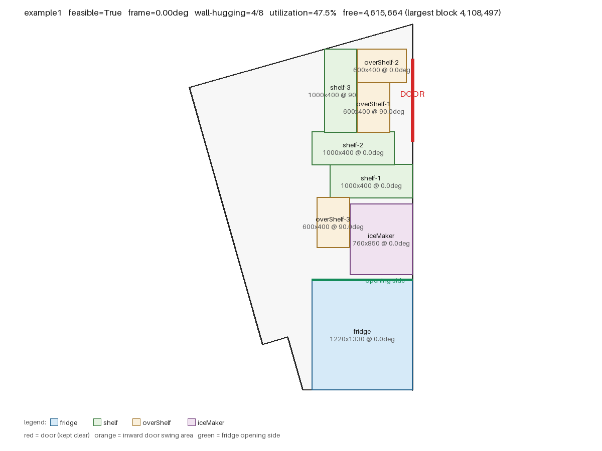
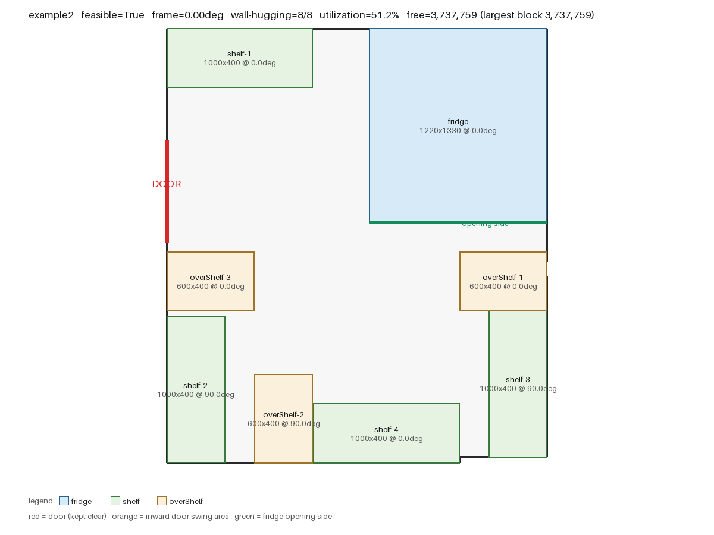
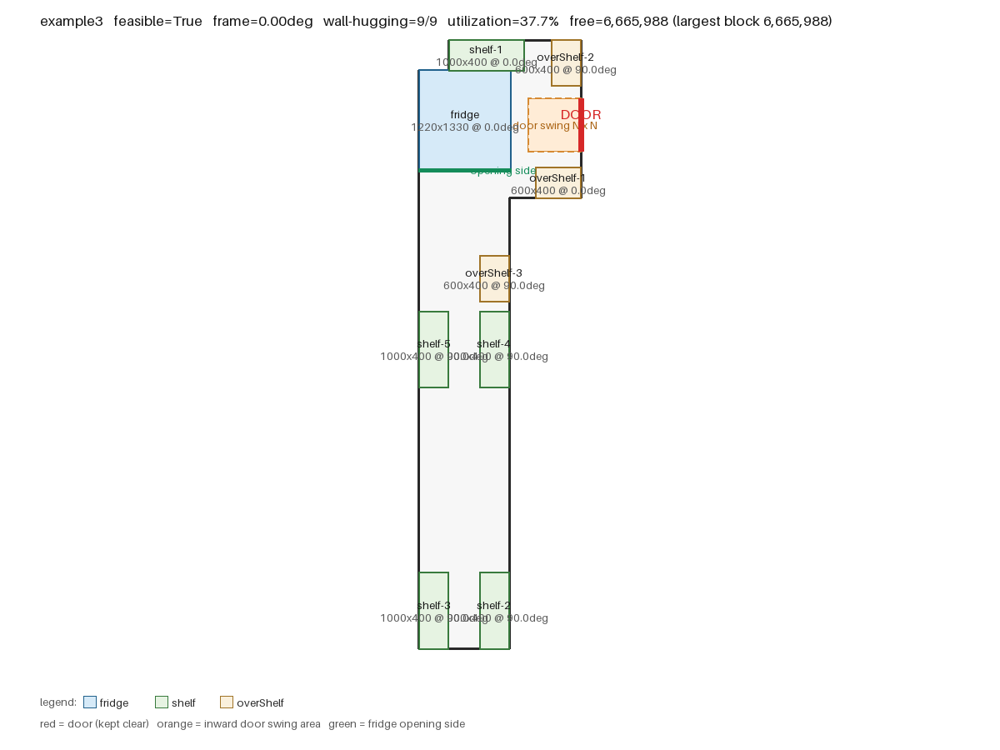
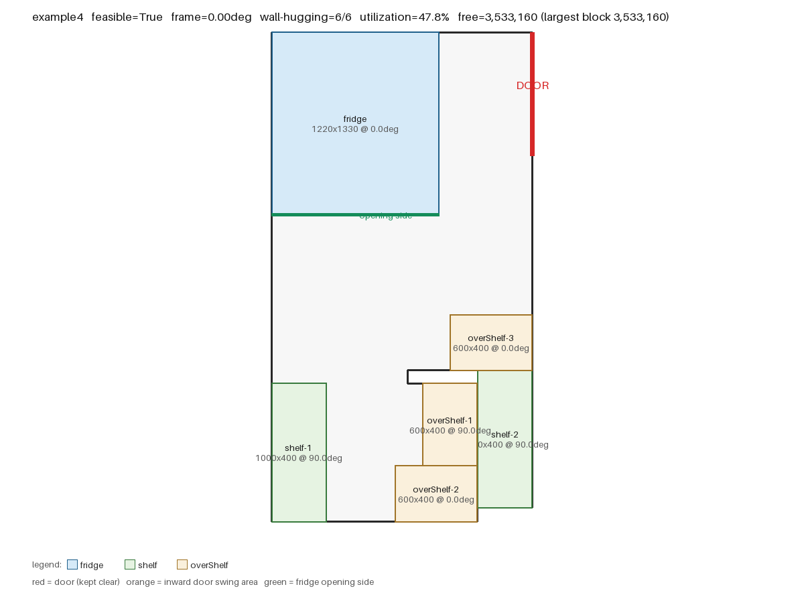
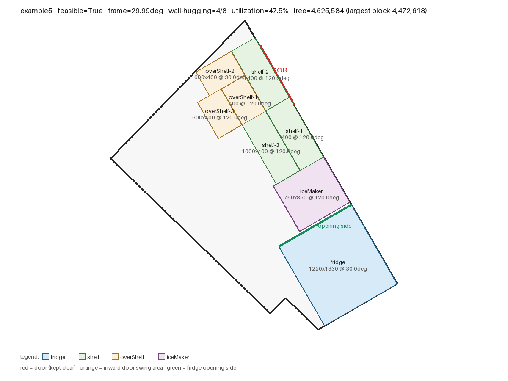
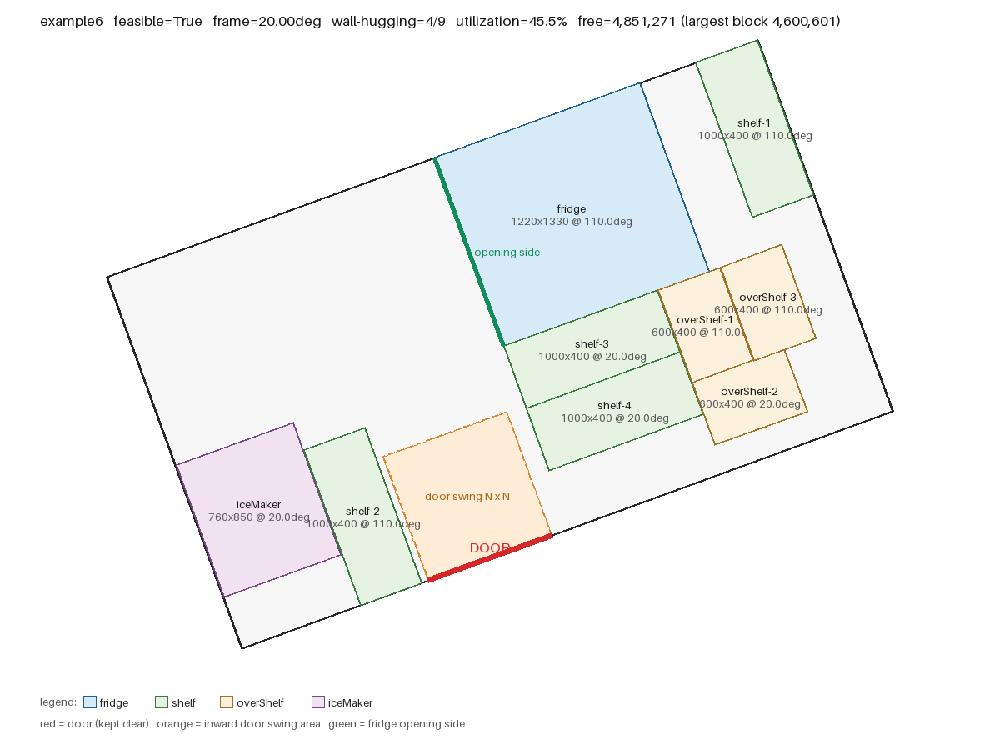

# 门店设备自动摆放求解器（居灵 Take-Home 工程题）

给定任意多边形轮廓、门的位置与若干矩形设备，自动求出一套**不越界、不重叠、不挡门、尽量贴墙**的摆放方案，
输出每件物品的中心点坐标与旋转角度，并给出**空间利用率**等量化指标。

语言：**Python 3**（核心求解只用标准库，出图需要 Pillow）。

---

## 结果一览（7 个样例）

| 样例 | 件数 | 朝向 | 输出角度 | 可行 | 贴墙 | 利用率 | 剩余可用面积 | 最大整块空地 | 耗时 |
|---|---|---|---|---|---|---|---|---|---|
| example1（题目） | 8 | 0° | 0° / 90° | ✅ | 4/8 | 47.5% | 4,615,664 | 4,108,497 | 1.6 s |
| example2（题目） | 8 | 0° | 0° / 90° | ✅ | 8/8 | 51.2% | 3,737,759 | 3,737,759 | 2.0 s |
| example3（题目，内开门） | 9 | 0° | 0° / 90° | ✅ | 9/9 | 37.7% | 6,665,988 | 6,665,988 | 3.7 s |
| example4（题目） | 6 | 0° | 0° / 90° | ✅ | 6/6 | 47.8% | 3,533,160 | 3,533,160 | 1.0 s |
| **example5（example1 整体旋转 30°）** | 8 | **29.99°** | **29.99° / 119.99°** | ✅ | 4/8 | 47.5% | 4,625,584 | 4,472,618 | 1.1 s |
| **example6（20° 斜墙房间，内开门）** | 9 | **20°** | **20° / 110°** | ✅ | 4/9 | 45.5% | 4,851,271 | 4,600,601 | 1.1 s |
| example7（小房间塞 9 件） | 9 | – | – | ❌ 判定不可行 | – | 需求密度 93% | – | – | 17.7 s |

前六个的输出 JSON 在 `output/*.json`，示意图在 `output/*.png`，全部通过内置自检
（在轮廓内 / 互不重叠 / 未挡门 / 冰箱开门侧无遮挡）。

### 关于"角度只有 0/90"这件事

题目给的四份数据（example1~4）主轴恰好都是正交的，所以最优解自然落在 0°/90°。
**算法本身不限制 0/90**——合法角度由轮廓边的方向决定（平行或垂直于某条轮廓边），
是算出来的不是写死的。为了验证这点，我加了两个斜的样例：

* **example5**：把 example1 的轮廓和门整体旋转 30°。求解器自动识别出朝向族 29.99°（不是 30° 整，是因为
  原始 CAD 数据本身有 0.006° 的偏差），输出角度 **29.99° / 119.99°**，摆放结果与 example1 等价。
* **example6**：20° 斜墙的平行四边形房间 + 内开门。输出角度 **20° / 110°**，
  内开门的 800×800 禁放区也跟着旋转，同样正确避让。

同一间房存在多个朝向族时，会**逐个求解再择优**。example1 就有两个族：

| 朝向族 | 贴墙件数 | 贴墙面积占比 | 最大整块空地 | 是否采用 |
|---|---|---|---|---|
| 0.00°（正交族，右墙 4428 + 底墙 1326） | 4/8 | **73%** | **4,108,497** | ✅ 采用 |
| 15.85°（斜族，墙总长更长但贴墙率低） | 2/8 | 54% | 3,325,157 | ✗ |

example5 是这个对比的 30° 版本，结论一致（29.99° 胜出）。

### 指标怎么读

* **利用率** = 物品占地 / 房间轮廓面积。只取决于输入，摆放方式改变不了它——
  真正能体现摆放好坏的是下面两个：
* **剩余可用面积**：栅格采样估算，扣掉物品与禁放区后还剩多少地面。
* **最大整块空地**：剩余空地做连通域分析后最大的那一块。**这个数才是关键**——
  同样剩 100 m²，一整块能走人能加货架，切成 6 块碎片就废了。

example2/3/4 的"最大整块空地 = 剩余可用面积"，说明空地完整没有被切碎；example1/5 因为房间本身是
带斜边的五边形且墙长不足，空地会被切成 3~6 块。

---

## 一、核心代码实现逻辑

### 1.1 题目约束 → 实现方式

| 题目要求 | 本项目的实现方式 | 可调参数（`layout_solver/config.py`） |
|---|---|---|
| 物品在轮廓内、互不重叠 | 矩形四角在多边形内（奇偶规则）+ 矩形边与轮廓边无"穿透式"相交；物品间用 SAT 分离轴判穿透 | `CONTACT_TOL` `OVERLAP_TOL` `INSIDE_TOL` |
| 可旋转，需与轮廓边平行或垂直 | 由轮廓边方向按 mod 90° 聚类出所有合法朝向族，**逐族求解后择优**；族内物品角度 = 族角度 或 +90° | `FRAME_CLUSTER_TOL` `FRAME_SNAP_TOL` |
| 优先考虑全部贴墙 | 候选位置只由"贴面"生成（墙 / 已放物品的边）；两轮搜索，第一轮**禁止悬空件**；最终方案按贴墙面积占比挑最优 | `MAX_BRANCH` `NODE_BUDGET` `TIME_BUDGET` `COMPACT_MODE` |
| 不可遮挡门 | 门洞线段不允许被任何矩形压到（闭合区域相交判定） | `DOOR_CLEARANCE_DEPTH`（默认 0 = 严格按字面；想要人行通道可设 800） |
| 内开门占据 N×N | 门内侧直接放一个 N×N 的方形禁放区（随朝向一起旋转） | 自动，由 `isOpenInward` 触发 |
| 冰箱 length 边为开门边，不能放东西 | 开门边必须朝室内（1 mm 探测带落在轮廓内），且后续任何物品不得压入这条探测带 | `FRIDGE_OPEN_BUFFER` |
| 货架的边可以放东西 | 物品之间允许"紧贴"（穿透 ≤ 1 mm 视为接触而非重叠） | `OVERLAP_TOL` |

**工程假设（题目没写死、我按字面 + 可落地的方式定的，全部可改）：**

1. 门洞禁放按字面执行：不允许压到门洞线段本身，不额外留通道；想留通道改一个参数即可。
2. 冰箱开门侧"不能放东西"按**不允许相贴**执行（1 mm 探测带），不额外留操作进深；
   若实际需要开门进深，把 `FRIDGE_OPEN_BUFFER` 调大即可（例如 800）。
3. 离地架（overShelf）按平面占地处理，**不与其他物品投影重叠**。现实中它架空在地面之上，
   若允许投影重叠可再放宽，但会让"互不重叠"这条硬约束的解释变复杂，这里取稳妥口径。
4. 同一个方案里所有物品共用一个朝向族（平行或垂直于同一组墙），这与门店实际摆放一致。

### 1.2 算法流程

```
预检：需求面积 > 可用面积？→ 直接判定不可行（秒回，不用搜索）
for 每个合法朝向族 θ（由轮廓边方向聚类得到，通常 1~2 个）:
    把整个房间（轮廓 / 门 / 禁放区）旋转 -θ
        → 该朝向下所有物品都是轴对齐矩形，"贴墙"退化为"把矩形推到某条线上再沿线滑动"
    for 每种摆放顺序（面积降 / 最长边降 / 面积升）:
        两轮 DFS：
            第一轮：禁止悬空（每个物品必须贴墙或贴已放物品）  ← 对应"优先贴墙"
            第二轮：放不下才允许悬空
        每个物品：枚举候选位置 → 合法性检查 → 打分排序 → 按分数从高到低尝试 → 失败回溯
    取所有方案里"贴墙面积占比"最高的那个
最后：算空间利用率 / 剩余空地 / 最大整块空地，并独立自检一遍
```

**候选位置怎么来的**（`solver.gen_positions`）：对每个"可贴的面"（真实墙 + 已放物品的四条边 + 禁放区边），
把矩形贴上去（外表面与面重合、朝房间内侧偏移），再沿面滑动。滑动的候选点取：

* 面的两个端点（贴角）；
* 所有轮廓顶点、已放物品边界、禁放区边界的投影（对齐已有物体，不产生错位缝隙）；
* 等距采样点（`SLIDE_STEP`，默认 150 mm，兜底）。

**打分**（越小越优先）：

```
贴角(0) > 贴一面墙(1) > 贴墙又贴物品(1.5) > 只贴物品(2) > 悬空(5)
同级别：接触长度越长越好  →  再同级：离已放物品群越近越好（摆紧凑）
```

**为什么这么做**：这类布局问题本质是带旋转的 2D 装箱（NP-hard），精确解代价太高。
用"贴面滑动 + 打分 + 有限回溯"的贪心搜索，能在秒级给出**可解释、可复现、贴墙率高**的方案，
并且天然满足"优先贴墙"的业务偏好。搜索受节点数与时间预算双重限制，超时即判定该朝向失败。

### 1.3 关键几何判定（`layout_solver/geometry.py`）

* **点在多边形内**：奇偶规则 + 边界容差。用奇偶规则而不是环绕数，是因为题目数据里存在
  自接触/重复边（example4 左墙被重复描了两遍），奇偶规则对这种退化输入仍然稳定。
* **矩形在多边形内**：四角在轮廓内（容差 1 mm，允许贴边）+ 矩形边与轮廓边无"穿透式"相交。
  共线重叠不算相交 —— 否则贴墙摆放会被误判成越界。
* **矩形重叠**：SAT 分离轴定理，取 4 个轴的最小穿透深度，> 1 mm 才算重叠（紧贴合法）。
* **是否挡门**：线段与矩形闭合区域的 Liang–Barsky 裁剪，含端点接触与共线重叠。
* **冰箱开门侧**：在开门边外侧生成 1 mm 探测带，要求探测带完全在轮廓内（保证门朝室内打得开），
  之后任何物品不得压入（薄带判重叠时用 0.01 mm 容差，避免被 1 mm 容差吃掉）。

### 1.4 空间利用率怎么算（`solver.compute_metrics`）

没有引入 shapely 之类的布尔运算库，用**栅格采样 + 连通域分析**（零依赖、对非凸轮廓同样适用）：

1. 在轮廓包围盒内打约 4 万个格点（`--grid-cells` 可调）；
2. 落在轮廓内、且不在任何物品/禁放区里的格子算"空的"；
3. 对空格子做一次 flood-fill 连通域分析，得到**最大整块空地面积**和**碎片块数**。

于是除了"利用率"这种由输入决定的数字，还能回答真正有用的问题：
**剩下多少地、是不是一整块、够不够再放一组货架。**

### 1.5 贴墙模式 vs 紧凑模式（对照实验）

题目要"优先贴墙"，但"空间利用率"听起来像是该把东西挤在一起。为了不拍脑袋，我把两种策略都实现了，
用指标说话（`--compact` 开启紧凑模式）：

| 样例 | 贴墙模式：贴墙件数 / 最大整块空地 / 碎片 | 紧凑模式：贴墙件数 / 最大整块空地 / 碎片 |
|---|---|---|
| example1 | 4/8 · 4,108,497 · 3 | 3/8 · 2,988,243 · 3 |
| example2 | 8/8 · **3,737,759** · **1** | 7/8 · 2,388,356 · 3 |
| example3 | 9/9 · 6,665,988 · 1 | 9/9 · 6,678,578 · 1 |
| example4 | 6/6 · **3,533,160** · **1** | 6/6 · 2,953,374 · 2 |
| example5 | 4/8 · **4,472,618** · 6 | 3/8 · 2,982,840 · 3 |
| example6 | 4/9 · **4,600,601** · 2 | 4/9 · 2,477,179 · 3 |

结论：**贴墙模式更好**。把物品沿墙铺开，空地会自然留在房间中央成为一整块（example2/3/4 碎片数 = 1）；
刻意把物品挤在一起反而把空地切碎（紧凑模式在 5 个样例上最大整块空地都更小、碎片更多）。
这也反过来验证了题目"优先贴墙"这条业务规则的合理性，所以默认用贴墙模式。

### 1.6 自检

`layout_solver/verify.py` 在世界坐标下用**另一套代码路径**重新检查一遍解（求解是在旋转坐标系里做的），
避免"自己判自己"：物品是否都在轮廓内、两两是否重叠、是否压门洞/内开门区、冰箱开门侧是否被挡。
运行 `main.py` 时会自动执行并打印结果。

### 1.7 AI 工具使用情况（题目要求说明）

1. **使用了哪些 AI 工具**：WorkBuddy（AI 编程助手，底层大模型 Claude），用于方案讨论、代码生成、Debug 与文档撰写。
2. **AI 主要帮助了哪些部分**：
   * 思路拆解：把"任意多边形 + 可旋转矩形"的摆放问题拆成"朝向枚举 → 贴面滑动生成候选 → 打分 → 回溯搜索"这条链路；
   * 代码生成：几何库（点在多边形内 / SAT / 线段-矩形裁剪）、求解器骨架、Pillow 出图；
   * Debug：浮点容差导致贴墙被误判重叠、只贴墙导致第二排放不下、薄禁放带被容差吃掉等问题；
   * 文档：本文档初稿。
3. **哪些关键逻辑是自己理解并调整的**：

   > ⚠️ 下面这段请按你的真实情况改写后再提交（AI 不会替你"理解"，写你自己实际做的判断）。
   > 以下是本项目里真正需要人拿主意、且会影响结果的几个判断点，可作为参考：

   * 冰箱开门侧的判定口径：取"不允许相贴"（1 mm 探测带），而不是留操作进深；
   * 门洞禁放按题目字面执行（`DOOR_CLEARANCE_DEPTH = 0`），而不是留 800 mm 人行通道；
   * 离地架按平面占地处理，不与其他物品投影重叠；
   * "优先贴墙"落地为两轮搜索（第一轮禁止悬空件），并用**面积加权贴墙率**挑选最终方案
     （避免为了凑件数把冰箱摆到房间中央）；
   * 用"最大整块空地 + 碎片数"评价空间利用，并用紧凑模式做对照实验，据此确认贴墙模式更优；
   * 复核输出：确认 example1 受墙长限制无法全部贴墙，接受 4/8（贴墙面积占比 73%）。

---

## 二、运行环境与运行方式

* Python **3.8+**（实测 3.13 可跑）
* 核心求解：**零第三方依赖**（只用标准库）
* 出 PNG 示意图需要 Pillow：`pip install pillow`（不装也不影响求解，会自动跳过出图）

```bash
git clone <你的仓库地址>
cd layout-solver
pip install -r requirements.txt        # 可选，只为出图

python main.py                          # 跑 examples/ 下全部样例
python main.py -i examples/example6.json          # 只跑一个（斜墙样例）
python main.py -i examples -o output              # 指定输出目录
python main.py --no-png                           # 只出 JSON
python main.py --compact                          # 紧凑模式（对照实验）
python main.py --door-clearance 800               # 门洞前额外留 800mm 通道
python main.py --grid-cells 100000                # 空地估算更精细（默认 4 万格）
```

单文件调用：

```python
from layout_solver.scene import load_scene
from layout_solver.solver import solve, solution_to_dict, compute_metrics
from layout_solver.verify import verify

scene = load_scene("examples/example6.json")
sol = solve(scene)
print(solution_to_dict(scene, sol))     # 结果字典（含 metrics）
print(compute_metrics(scene, sol))      # 只看空间指标
print(verify(scene, sol))               # [] 表示自检通过
```

输出字段：

```jsonc
{
  "feasible": true,                 // 是否可行
  "frame_angle": 20.0,              // 该方案采用的朝向（度）
  "wall_hugging": "4/9",            // 贴墙件数
  "wall_area_ratio": 0.72,          // 贴在墙上的物品面积占比
  "floating": 0,                    // 既没贴墙也没贴其他物品的件数
  "reason": "",                     // 不可行时的原因
  "metrics": {
    "room_area": 10080000,          // 房间轮廓面积
    "items_area": 4588600,          // 物品占地
    "utilization": 0.455,           // 利用率 = 物品占地 / 房间面积
    "demand_ratio": 0.486,          // 需求密度 = 物品占地 / (房间 - 禁放区)
    "free_area": 4851271,           // 剩余可用面积（栅格采样）
    "largest_free_area": 4600601,   // 最大一整块空地
    "free_fragments": 2,            // 空地被切成几块
    "reserved_area": 640000,        // 内开门等禁放区面积
    "usable_wall_length": 13200     // 该朝向下可贴墙的总长度
  },
  "placements": [
    {
      "name": "fridge",
      "type": "fridge",
      "center": [51999.88, 52632.78],  // 中心点坐标
      "angle": 110.0,                  // 相对给定 (length, width) 初始姿态逆时针旋转的度数
      "size": [1220.0, 1330.0],
      "wall_contacts": 2,
      "fridge_opening_side": "left"    // 仅冰箱：开门边朝向
    }
  ]
}
```

角度约定：`angle = 0` 表示 length 沿 +x、width 沿 +y；`angle = 90` 表示整体逆时针转 90°
（length 沿 +y）。朝向族非 0 时输出的就是族角度或其 +90°，例如 example6 的 20° / 110°。

---

## 三、既定输入的输出示例

### example1（8 件，五边形带斜墙）

`feasible = true`，朝向 0.00°，贴墙 4/8（面积占比 73%），利用率 47.5%，最大整块空地 4,108,497

| 物品 | 中心点 | 角度 | 贴墙面数 |
|---|---|---|---|
| fridge 1220×1330 | (6511.74, 29407.38) | 0° | 2（开门边朝上） |
| iceMaker 760×850 | (6741.74, 30567.07) | 0° | 1 |
| shelf-1 1000×400 | (6621.74, 31265.93) | 0° | 1 |
| shelf-2 1000×400 | (6401.74, 31665.93) | 0° | 0 |
| shelf-3 1000×400 | (6251.74, 32365.93) | 90° | 0 |
| overShelf-1 600×400 | (6651.74, 32165.93) | 90° | 0 |
| overShelf-2 600×400 | (6751.74, 32665.93) | 0° | 0 |
| overShelf-3 600×400 | (6161.74, 30765.93) | 90° | 0 |



### example2（8 件，右侧带凹口）

`feasible = true`，朝向 0.00°，贴墙 8/8（100%），利用率 51.2%，空地一整块 3,737,759

| 物品 | 中心点 | 角度 | 贴墙面数 |
|---|---|---|---|
| fridge 1220×1330 | (30986.39, 34305.03) | 0° | 3（开门边朝下） |
| shelf-1 1000×400 | (29493.39, 34770.03) | 0° | 2 |
| shelf-2 1000×400 | (29193.39, 32500.03) | 90° | 3 |
| shelf-3 1000×400 | (31396.39, 32540.03) | 90° | 2 |
| shelf-4 1000×400 | (30496.39, 32200.03) | 0° | 2 |
| overShelf-1 600×400 | (31296.39, 33240.03) | 0° | 2 |
| overShelf-2 600×400 | (29793.39, 32300.03) | 90° | 1 |
| overShelf-3 600×400 | (29293.39, 33240.03) | 0° | 1 |



### example3（9 件，狭长房，内开门 700×700）

`feasible = true`，朝向 0.00°，贴墙 9/9（100%），利用率 37.7%，空地一整块 6,665,988
（橙色虚线框为内开门占用的 700×700 空间，已自动避让）

| 物品 | 中心点 | 角度 | 贴墙面数 |
|---|---|---|---|
| fridge 1220×1330 | (56508.31, 36488.11) | 0° | 2（开门边朝下） |
| shelf-1 1000×400 | (56798.31, 37353.11) | 0° | 2 |
| shelf-2 1000×400 | (56898.31, 29983.11) | 90° | 2 |
| shelf-3 1000×400 | (56098.31, 29983.11) | 90° | 2 |
| shelf-4 1000×400 | (56898.31, 33447.05) | 90° | 1 |
| shelf-5 1000×400 | (56098.31, 33447.05) | 90° | 1 |
| overShelf-1 600×400 | (57748.31, 35653.11) | 0° | 2 |
| overShelf-2 600×400 | (57848.31, 37253.11) | 90° | 2 |
| overShelf-3 600×400 | (56898.31, 34385.96) | 90° | 1 |



### example4（6 件，带凹口的矩形）

`feasible = true`，朝向 0.00°，贴墙 6/6（100%），利用率 47.8%，空地一整块 3,533,160

| 物品 | 中心点 | 角度 | 贴墙面数 |
|---|---|---|---|
| fridge 1220×1330 | (183483.59, 32437.72) | 0° | 2（开门边朝下） |
| shelf-1 1000×400 | (183073.59, 30042.72) | 90° | 4 |
| shelf-2 1000×400 | (184573.59, 30142.72) | 90° | 4 |
| overShelf-1 600×400 | (184173.59, 30242.72) | 90° | 2 |
| overShelf-2 600×400 | (184073.59, 29742.72) | 0° | 2 |
| overShelf-3 600×400 | (184473.59, 30842.72) | 0° | 2 |



### example5（example1 整体旋转 30° —— 验证任意角度）

`feasible = true`，朝向 **29.99°**，输出角度 **29.99° / 119.99°**，贴墙 4/8，利用率 47.5%

| 物品 | 中心点 | 角度 | 贴墙面数 |
|---|---|---|---|
| fridge 1220×1330 | (6869.98, 29832.49) | 29.99° | 2（开门边朝上） |
| iceMaker 760×850 | (6485.19, 30869.20) | 119.99° | 1 |
| shelf-1 1000×400 | (6239.94, 31743.72) | 119.99° | 1 |
| shelf-2 1000×400 | (5740.02, 32609.79) | 119.99° | 1 |
| shelf-3 1000×400 | (5893.50, 31543.75) | 119.99° | 0 |
| overShelf-1 600×400 | (5493.58, 32236.61) | 119.99° | 0 |
| overShelf-2 600×400 | (5157.01, 32619.66) | 29.99° | 0 |
| overShelf-3 600×400 | (5147.14, 32036.65) | 119.99° | 0 |



### example6（20° 斜墙房间 + 内开门 800×800）

`feasible = true`，朝向 **20°**，输出角度 **20° / 110°**，贴墙 4/9，利用率 45.5%，最大整块空地 4,600,601

| 物品 | 中心点 | 角度 | 贴墙面数 |
|---|---|---|---|
| fridge 1220×1330 | (51999.88, 52632.78) | 110° | 2（开门边朝左） |
| iceMaker 760×850 | (50098.86, 50839.44) | 20° | 1 |
| shelf-1 1000×400 | (53108.93, 53153.50) | 110° | 1 |
| shelf-2 1000×400 | (50731.09, 50798.19) | 110° | 1 |
| shelf-3 1000×400 | (52121.87, 51815.19) | 20° | 0 |
| shelf-4 1000×400 | (52258.68, 51439.31) | 20° | 0 |
| overShelf-1 600×400 | (52813.86, 51960.64) | 110° | 0 |
| overShelf-2 600×400 | (53078.84, 51524.99) | 20° | 0 |
| overShelf-3 600×400 | (53189.73, 52097.44) | 110° | 0 |



### example7（小房间塞 9 件 —— 判定不可行的输出）

2200×2200 的房间，内开门占掉 600×600，9 件物品需求面积 4,182,600，可用 4,480,000（需求密度 93%）。
搜完预算给出结论：`feasible = false`，并说明原因。

```
[example7] feasible=False
    空间: 房间 4,840,000  物品占地 4,182,600  利用率 86.4%  可贴墙长 8,800  禁放区 360,000
    判定不可行：搜索预算内没找到可行解：物品需求面积 4,182,600，可用面积 4,480,000，需求密度 93%
    未放下: ['fridge', 'shelf-1', ..., 'overShelf-4']
```

另外做了**秒级预检**：如果物品需求面积直接超过可用面积（`quick_infeasibility`），
不搜索直接返回不可行并给出面积账，避免在注定失败的输入上烧时间。

图中：灰色为房间轮廓，红线为门（保持净空），橙虚线框为内开门 N×N 禁放区，
绿色粗线为冰箱开门边，矩形内标注名称 / 尺寸 / 角度，标题给出利用率与最大整块空地。

---

## 四、目录结构

```
layout-solver/
├── main.py                   命令行入口
├── gen_examples.py           生成 example5/6/7 三个补充样例（旋转、斜墙、不可行）
├── layout_solver/
│   ├── config.py             所有可调参数与容差
│   ├── geometry.py           向量 / 多边形 / OBB / 相交判定
│   ├── scene.py              输入解析（轮廓、门、内开门 N×N、物品）
│   ├── solver.py             核心求解 + 空间指标（利用率 / 剩余空地 / 连通域分析）
│   ├── verify.py             世界坐标下的独立自检
│   └── visualize.py          Pillow 出图
├── examples/
│   ├── example1~4.json       题目给定的四份输入
│   └── example5~7.json       补充：30° 旋转 / 20° 斜墙+内开门 / 放不下
├── output/                   运行结果（*.json + *.png，7 份）
├── requirements.txt
└── README.md
```

---

## 五、已知边界与可继续优化的点

* **非凸 / 退化轮廓**：已能处理凹口、狭长房、重复边（example4 左墙被描了两遍）、斜墙与旋转房间；
  但对真正自相交（"8 字型"）的多边形不做处理。
* **搜索是启发式的**：不保证在所有输入上都找到解（NP-hard 问题的固有代价）。
  放不下时返回 `feasible=false` 并给出原因与未放下清单。想加强搜索可以把
  `MAX_BRANCH`、`NODE_BUDGET`、`TIME_BUDGET` 调大，或把 `SLIDE_STEP` 调小（更精细但更慢）。
* **剩余空地是采样估算**：默认 4 万格，误差约 0.5%；`--grid-cells` 可调。
* **只做平面摆放**：不考虑高度方向，离地架默认按占地处理（见 1.1 假设 3）。
* **可以加的改进**：① 多目标打分（离门远近、同类物品集中、动线宽度）；
  ② 用"最大空矩形"做初始布局再局部搜索；③ 把解导出成 DXF/CAD 可直接用的格式。
